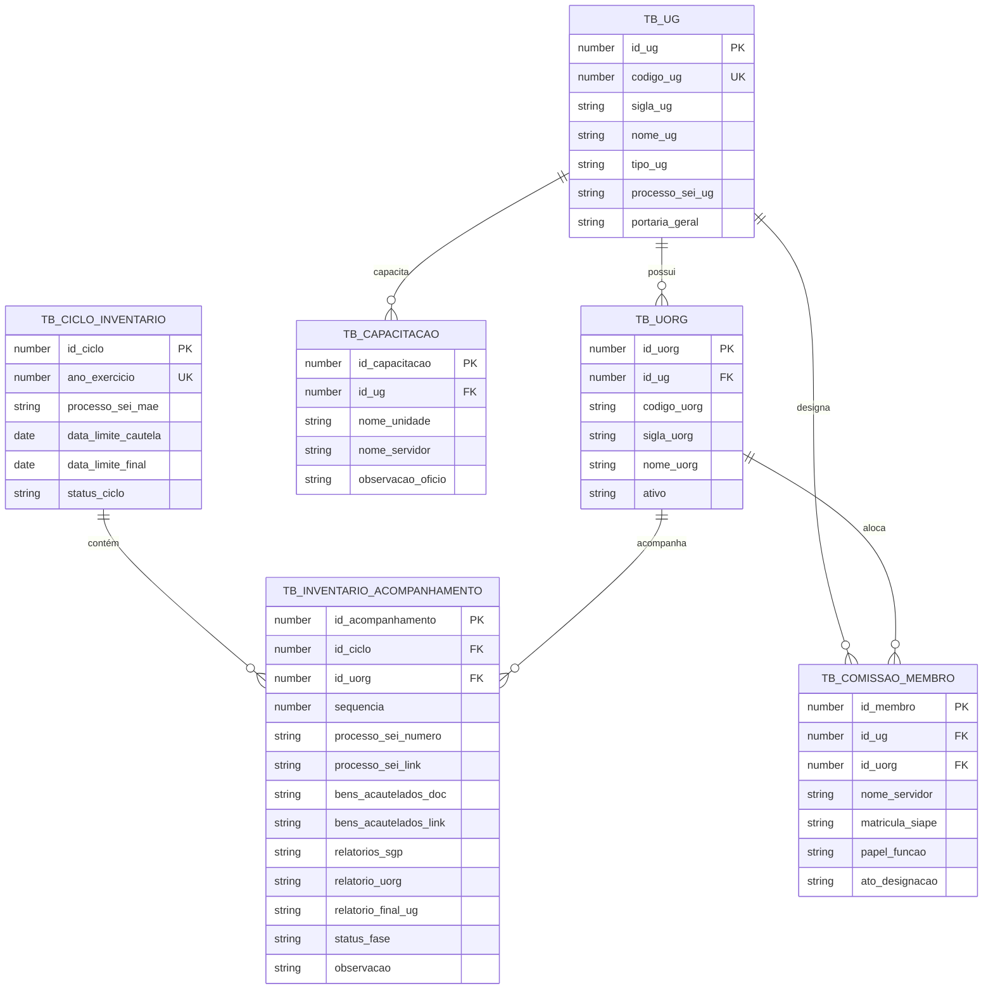

# AGENT.MD — Guia de Engenharia e Operação do Sistema de Inventário SENAPPEN

> **Status:** Documento de Referência Arquitetural e Operacional  
> **Versão:** 1.0.0  
> **Idioma Padrão:** Português Brasil (pt-BR)  
> **Fase Atual:** Análise, Normalização de Dados e Preparação GAS  
> **Fase Futura:** Migração para Oracle APEX  

---

## 1. Visão Geral e Propósito

Este repositório contém a inteligência, dados e código para o **Sistema de Gestão e Acompanhamento do Inventário Anual de Bens Patrimoniais da SENAPPEN (Secretaria Nacional de Políticas Penais)**.

O sistema foi concebido para transformar o acompanhamento descentralizado (anteriormente conduzido via planilhas estáticas com múltiplas abas) em uma solução automatizada, dinâmica e escalável:
1. **Fase 1 (Atual):** Implementação ágil utilizando **Google Sheets + Google Apps Script (GAS)**, oferecendo interface web responsiva (HTML Service) ou sidebar/menus avançados, cálculo automático de prazos/etapas e consolidação em tempo real.
2. **Fase 2 (Evolutiva):** Migração estruturada para o ecossistema corporativo **Oracle APEX** (Oracle Database), aproveitando o modelo de dados já normalizado desde a concepção.

---

## 2. Diretrizes Mandatórias do Projeto

- **Linguagem:** Todas as tarefas, planos de trabalho, comentários de código, documentações e mensagens de commit do Git devem ser estritamente em **Português Brasil (pt-BR)**.
- **Convenção de Commits:** Padrão Conventional Commits em português (ex.: `feat: adiciona seed consolidado de uorgs`, `docs: cria documentação arquitetural agent.md`, `fix: normaliza espacos em branco de codigos uorg`).
- **Dinamicidade:** Nenhum parâmetro de diretoria, status ou prazo deve ser fixado de forma rígida (*hardcoded*). A arquitetura deve permitir inclusão de novas UORGs, novos exercícios anuais e novas regras sem alteração de código central.
- **Isolamento de Camadas:** A lógica de validação e transformação deve estar separada da camada de apresentação (seja ela Google Sheets, Web App GAS ou Oracle APEX).

---

## 3. Diagnóstico e Varredura da Planilha Base (`Inventário_Senappen_2026.xlsx`)

### 3.1. Visão das Abas
O arquivo bruto em `docs/Inventário_Senappen_2026.xlsx` possui 12 abas:
- **10 Abas Operacionais de Unidades Gestoras (UGs):**
  - `DIREX`: Diretoria Executiva (UG 200326) — 41 UORGs
  - `DISPF_DDPF`: Diretoria de Política Penal Federal (UG 200323) — 6 UORGs
  - `DIRPP`: Diretoria de Políticas Penitenciárias (UG 200324) — 6 UORGs
  - `DIPEN`: Diretoria de Inteligência Penitenciária (UG 200327) — 8 UORGs
  - `DICAP`: Diretoria de Cidadania e Alternativas Penais (UG 200456) — 8 UORGs
  - `PFCG`: Penitenciária Federal em Campo Grande (UG 200600) — 22 UORGs
  - `PFCAT`: Penitenciária Federal em Catanduvas (UG 200601) — 9 UORGs
  - `PFPV`: Penitenciária Federal em Porto Velho (UG 200603) — 25 UORGs
  - `PFMOS`: Penitenciária Federal em Mossoró (UG 200602) — 36 UORGs
  - `PFBRA`: Penitenciária Federal em Brasília (UG 200604) — 63 UORGs
- **2 Abas de Apoio/Cadastrais:**
  - `Capacitação para o Invnetário`: Relação de 10 servidores das Penitenciárias Federais participantes do treinamento presencial na sede da SENAPPEN.
  - `Informação`: Mapeamento consolidado derivado da *Informação 53 (SEI nº 36833070)* com 221 UORGs e a designação nominal e matrículas SIAPE dos integrantes da comissão.

### 3.2. Métricas Consolidadas dos Dados Brutos
- **Total de UORGs Mapeadas:** 224 registros
- **Processos SEI Autuados:** 185 (82,6% de cobertura)
- **Processos com Hyperlinks Diretos ao SEI:** 113 (50,4%)
- **Declarações de Bens Acautelados Registradas:** 53 (23,7%)
- **Atos de Comissão/Designação Diretos:** 20 (8,9%) — os demais encontram-se na aba `Informação` ou vinculados à Portaria geral da UG.
- **Relatórios SGP / UORG / Final:** Fases subsequentes (apenas 1 registro preenchido como "SGP" em PFBRA), evidenciando que o ciclo está ativo na fase de coleta de cautelas e instrução de processos.

### 3.3. Inconsistências Detectadas e Tratadas na Sanitização
1. **Espaços Rígidos (`\xa0`):** Presentes em grande volume em códigos de UORG (ex.: `'35010\xa0'`), nomes de setores e despachos. Removidos na rotina de extração.
2. **Divergência de Layout:** A aba `PFCG` inicia seus dados a partir da linha 4 com linhas vazias antes, enquanto as demais iniciam o cabeçalho na linha 2.
3. **Hiperlinks Internos vs Externos:** Os links de processos apontam para o SEI MJ (`https://sei.mj.gov.br/...`). Devem ser preservados em campo próprio (`processo_sei_link`) para que a interface final forneça acesso em um clique.
4. **Typo Histórico:** O nome da aba de capacitação continha `"Invnetário"`, corrigido nas sementes estruturadas.

---

## 4. Arquitetura de Dados: Google Planilhas & Oracle APEX

Para assegurar uma migração suave e sem retrabalho para o Oracle APEX, a estrutura do Google Sheets deve refletir exatamente o **modelo relacional normalizado (3FN)** do banco de dados relacional.

### 4.1. Esquema Relacional e Dicionário de Dados



### 4.2. Mapeamento das Abas do Google Planilhas

Na implementação em Google Sheets, a pasta de trabalho terá:
1. `tb_ug`: Catálogo das 10 Unidades Gestoras.
2. `tb_ciclo`: Definição de prazos gerais e processo mãe (31/08 e 30/11).
3. `tb_uorg`: Cadastro das 224 Unidades Organizacionais vinculadas às UGs.
4. `tb_inventario_acompanhamento`: Fato principal com status de cada UORG no ciclo 2026.
5. `tb_comissao_membro`: Integrantes das comissões com SIAPE e portarias.
6. `tb_capacitacao`: Servidores que fizeram a capacitação.
7. `vw_dashboard_dinamico`: Visão analítica consolidada calculada via Apps Script ou fórmulas matriciais, com filtros por Diretoria/Penitenciária.

---

## 5. Dinamicidade e Regras de Negócio do Sistema

### 5.1. Classificação Hierárquica e Filtros
O sistema deve permitir filtrar e agrupar dinamicamente em 3 níveis:
- **Nível 1 - Grupo Institucional:**
  - `DIRETORIAS` (Sede / SENAPPEN Central): DIREX, DPPF, DIRPP, DIPEN, DICAP.
  - `PENITENCIARIAS_FEDERAIS` (SPF / Unidades Descentralizadas): PFCG, PFCAT, PFPV, PFMOS, PFBRA.
- **Nível 2 - Unidade Gestora (UG):** Seleção de uma UG específica.
- **Nível 3 - Unidade Organizacional (UORG):** Seleção do setor específico.

### 5.2. Máquina de Estados (Fases do Inventário)
Cada UORG transita pelos seguintes estados calculados dinamicamente:
1. `PENDENTE_INICIAL`: Sem processo SEI autuado e sem comissão.
2. `PROCESSO_AUTUADO`: Processo SEI aberto para a UORG.
3. `CAUTELA_INFORMADA`: Declaração de cautela de bens patrimoniais entregue (marco de 31/08/2026).
4. `EM_RELATORIO`: Relatórios SGP (localizados, não localizados, resumido) ou relatório setorial da UORG emitidos.
5. `CONCLUIDO`: Relatório Final da UG consolidado e aprovado (marco de 30/11/2026).

### 5.3. Alertas de Prazos (SLA)
- **Alerta Cautela:** Se a data atual for posterior a `31/08/2026` e `bens_acautelados_doc` for nulo $\rightarrow$ `ATRASO_CAUTELA` (Crítico).
- **Alerta Final:** Se a data atual for posterior a `30/11/2026` e `relatorio_final_ug` for nulo $\rightarrow$ `ATRASO_FINAL` (Crítico).
- **Aviso Preventivo:** Faltando 15 dias para qualquer um dos marcos $\rightarrow$ `ALERTA_PRAZO_PROXIMO`.

---

## 6. Estrutura do Código em Google Apps Script (GAS)

O projeto em Apps Script deve ser organizado modularmente em arquivos `.gs` e `.html`:

```
gas/
├── Config.gs              # Constantes, IDs de planilhas, nomes de abas e mapeamentos
├── Models.gs              # Classes e estruturas DTO (UG, UORG, InventarioItem)
├── DatabaseService.gs     # Camada DAO para ler/escrever nas abas da planilha
├── InventarioService.gs   # Lógica de negócio, máquina de estados e cálculo de SLA
├── SeedImporter.gs        # Rotina de carga e reset dos dados a partir dos seeds
├── Api.gs                 # Handlers doGet/doPost para servir Web App ou JSON
└── ui/
    ├── index.html         # Dashboard SPA moderno (HTML5 + CSS + Vanilla JS)
    ├── styles.html        # Design system, temas claro/escuro, cores institucionais
    └── scripts.html       # Lógica do frontend, filtros dinâmicos e cards analíticos
```

---

## 7. Roteiro de Migração para Oracle APEX

A transição para Oracle APEX ocorrerá sem atrito devido aos seguintes fatores:
1. **DDL e DML Prontos:** O arquivo `data/seeds/schema_oracle.sql` já contém a estrutura completa de tabelas com chaves primárias `IDENTITY`, chaves estrangeiras, constraints e view analítica.
2. **Mapeamento de Telas no APEX:**
   - **Página 1 (Home/Dashboard):** Cards com contadores de status (Total UORGs, Processos Autuados, Cautelas Entregues, Concluídos) e gráficos de rosca por Diretoria.
   - **Página 2 (Faceted Search / Interactive Grid):** Visão baseada na `VW_DASHBOARD_INVENTARIO`, permitindo filtragem por Diretoria, Tipo de UG, Status de Fase e Alerta de Prazo.
   - **Página 3 (Formulário Modal de Atualização):** Edição rápida do processo SEI, número da declaração e anexo/link.
   - **Página 4 (Gestão de Comissões e Capacitação):** Relatórios interativos das tabelas `TB_COMISSAO_MEMBRO` e `TB_CAPACITACAO`.
3. **Automações APEX:** Uso de *Automations* do Oracle APEX para disparar e-mails automáticos aos presidentes de comissão quando os prazos se aproximarem.

---

## 8. Sementes Disponíveis no Repositório

Os seguintes arquivos de dados sanitizados estão prontos em `data/seeds/`:
- `ug_seed.json`: Metadados das 10 Unidades Gestoras.
- `inventario_uorg_seed.json`: 224 registros consolidados de UORGs com processos, links e status.
- `comissao_membros_seed.json`: Servidores integrantes com matrícula e comissão.
- `capacitacao_seed.json`: Servidores capacitados presencialmente.
- `consolidado_inventario_2026.csv`: Formato tabular separado por ponto-e-vírgula para importação imediata no Google Planilhas.
- `schema_oracle.sql`: Script DDL/DML completo para Oracle Database / Oracle APEX.

---

## 9. Próximos Passos (Plano de Implementação Futuro)

Quando autorizado pelo usuário, as seguintes etapas serão iniciadas:
1. Criação da estrutura de código Apps Script local (`src/gas/`).
2. Script de sincronização via Google Apps Script API ou importador direto.
3. Construção do frontend do Dashboard (interface Web moderna e responsiva com filtros dinâmicos por diretoria).
4. Homologação das regras de negócio e cálculo de SLA.
5. Preparação do pacote de exportação para carga no Oracle APEX.
